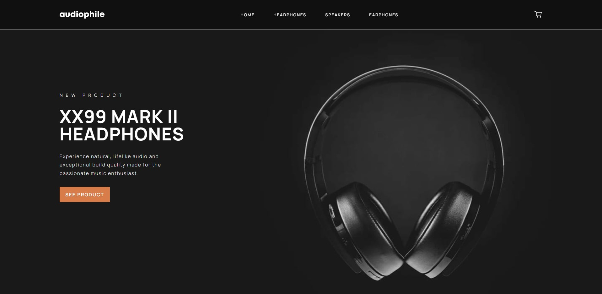
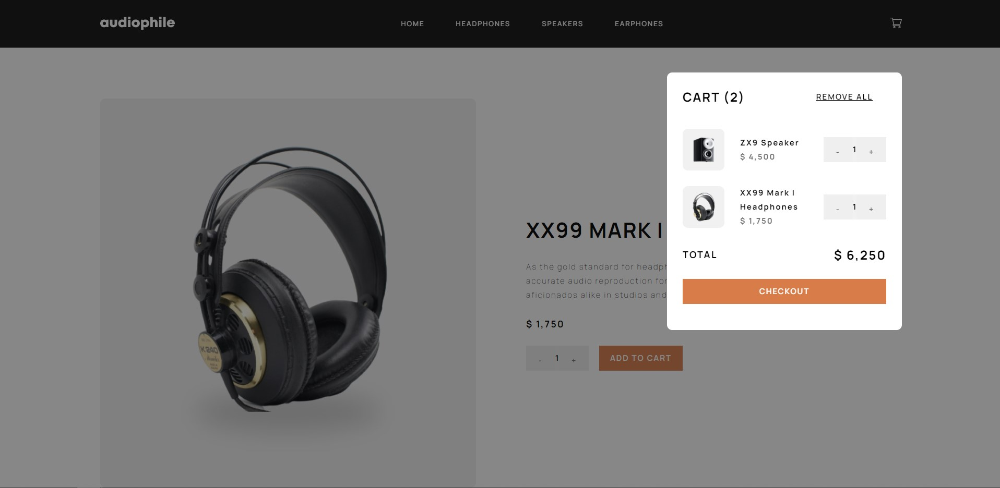
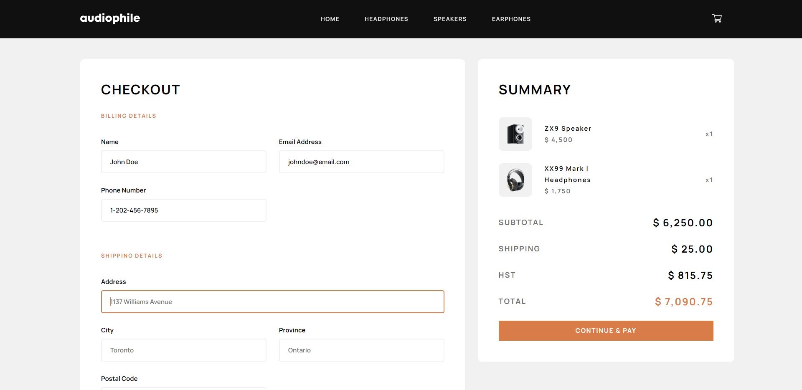

# React E-Commerce Site - Audiophile

This application is created to imitate a modern e-commerce site
with images and layout design provided by [Frontend Mentor](https://www.frontendmentor.io/challenges/audiophile-ecommerce-website-C8cuSd_wx).

[Live Link](https://vkwho-react-ecommerce-app.netlify.app/)

View more images in **screenshots** folder - desktop, tablet, mobile:

---

### The purpose of this project is to learn and gain practice with:

- React, Context, React-Router
- Sass
- Apply styles by translating design files to code
- Responsive Design

---

### Built with:

- React
- Sass

---
